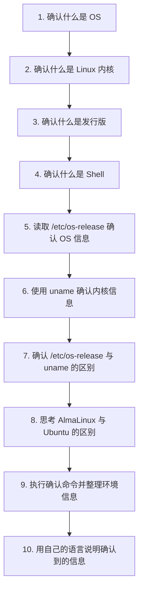

# 01_os_and_distribution

## 本章目标

在本章中，你将确认 Linux 环境中 **OS**、**Linux 内核**、**发行版** 之间的区别。

在计算机系统学习中，“OS”这个词经常出现。
但在使用 Linux 时，需要区分以下术语：

* OS
* Linux
* Linux 内核
* 发行版
* 版本
* 架构

本章不会只把这些词当作术语来背诵。
你将通过在实际 Linux 环境中运行命令，并读取显示的信息来理解它们。

## 本章流程



---

## 学习流程

在本章中，你将：

1. 确认什么是 OS
2. 确认什么是 Linux 内核
3. 确认什么是发行版
4. 确认什么是 Shell
5. 读取 `/etc/os-release` 确认 OS 信息
6. 使用 `uname` 确认内核信息
7. 确认 `/etc/os-release` 与 `uname` 的区别
8. 思考 AlmaLinux 与 Ubuntu 的区别
9. 执行确认命令并整理环境信息
10. 用自己的语言说明确认到的信息

---

## 1. 什么是 OS

OS 是 Operating System（操作系统）的缩写。

OS 是位于计算机硬件与应用程序之间、管理整台计算机的基础软件。

例如，OS 会管理：

* CPU
* 内存
* 存储
* 文件
* 进程
* 用户
* 网络
* 输入/输出设备

Windows、macOS、Linux 都是 OS 的例子。

学习 Linux 不只是记住命令。
也包括观察 OS 是如何管理计算机的。

---

## 2. 什么是 Linux 内核

严格来说，Linux 这个词本来指的是 **Linux 内核**。

内核是 OS 的核心部分。
它管理靠近硬件的部分，并让应用程序和命令可以安全地使用计算机。

例如，内核承担以下职责：

* 进程管理
* 内存管理
* 文件系统管理
* 设备管理
* 网络通信管理

我们平时使用的“Linux”并不只有内核。
它是由内核、命令、库、包管理系统、配置文件等组合而成的。

---

## 3. 什么是发行版

将 Linux 内核与各种软件和管理工具组合，打包成可用形态的系统，称为 **Linux 发行版**。

常见发行版有：

* Ubuntu
* Debian
* AlmaLinux
* Rocky Linux
* Fedora
* Arch Linux

即使都叫 Linux，不同发行版也有差异。

例如，包管理命令可能不同。

| 系列 | 例子 | 包管理 |
| --- | --- | --- |
| Debian 系 | Ubuntu, Debian | `apt` |
| Red Hat 系 | AlmaLinux, Rocky Linux, Fedora | `dnf`, `yum` |

因此，使用 Linux 时，不仅要知道“这是 Linux”，还要确认 **你使用的是哪个发行版**。

---

## 4. 什么是 Shell

在操作 Linux 时，我们通常会在终端输入命令。

此时，负责接收用户输入、解释命令并向 OS 请求执行的程序，叫做 **Shell**。

Shell 就像用户与 OS 之间的接口。

```text
用户
-> Shell
-> OS / 内核
-> 硬件
```

例如，你输入下面这条命令：

```bash
ls
```

Shell 会解释 `ls`，并执行对应程序。
结果会显示当前目录中的文件和目录列表。

---

### Shell 的种类

Linux 中有多种 Shell。

常见的有：

| Shell | 说明 |
| --- | --- |
| `sh` | 基础的 Unix 风格 Shell |
| `bash` | 许多 Linux 环境常用的代表性 Shell |
| `zsh` | 补全等功能更强的 Shell |
| `fish` | 强调易用性的 Shell |

在课程和教材中，最常使用的是 `bash`。

可通过以下命令查看当前使用的 Shell：

```bash
echo $SHELL
```

显示示例：

```text
/bin/bash
```

也可以通过下面的命令查看当前运行中的 Shell 进程：

```bash
ps
```

显示示例：

```text
	PID TTY          TIME CMD
 1234 pts/0    00:00:00 bash
 1250 pts/0    00:00:00 ps
```

在这个例子中可以看出，当前运行的 Shell 是 `bash`。

---

### Shell 与命令输入

Shell 不只是执行命令。

它还具备以下功能：

* 解释命令
* 处理变量
* 使用管道 `|` 连接命令
* 用 `>` 和 `>>` 做输出重定向
* 执行 Shell 脚本
* 管理命令历史

也就是说，在 Linux 中的大多数命令行操作，都是通过 Shell 完成的。

---

### OS、内核、Shell 的关系

它们之间可以这样整理：

| 术语 | 角色 |
| --- | --- |
| 内核 | 管理靠近硬件部分的 OS 核心 |
| 发行版 | Linux 内核与各类软件的组合包 |
| Shell | 接收用户命令并请求 OS 处理的程序 |
| 终端 | 用于操作 Shell 的界面/应用 |

这里最重要的一点是：**终端和 Shell 不是同一个东西**。

终端是输入与显示文字的界面。
Shell 是在终端里运行的命令解释程序。

```text
终端
-> 用来操作 Shell 的界面

Shell
-> 解释并执行命令的程序
```

理解这个区别后，你就能更准确地说明 Linux 操作。

---

## 5. 确认 OS 信息

在 Linux 环境中，可以通过 `/etc/os-release` 查看 OS 和发行版信息。

```bash
cat /etc/os-release
```

显示示例：

```text
NAME="AlmaLinux"
VERSION="9.5 (Teal Serval)"
ID="almalinux"
VERSION_ID="9.5"
PLATFORM_ID="platform:el9"
PRETTY_NAME="AlmaLinux 9.5 (Teal Serval)"
```

需要关注的要点如下：

| 项目 | 含义 |
| --- | --- |
| `NAME` | 发行版名称 |
| `VERSION` | 版本名 |
| `ID` | 系统内部使用的标识名 |
| `VERSION_ID` | 版本号 |
| `PRETTY_NAME` | 便于人阅读的显示名 |

通过这些信息，你可以判断自己正在使用的 Linux 类型。

---

## 6. 确认内核信息

接下来，确认内核信息。

```bash
uname -a
```

显示示例：

```text
Linux localhost.localdomain 5.14.0-503.el9.x86_64 #1 SMP PREEMPT_DYNAMIC x86_64 GNU/Linux
```

该结果包含如下信息：

| 信息 | 含义 |
| --- | --- |
| `Linux` | 内核名 |
| `localhost.localdomain` | 主机名 |
| `5.14.0-503.el9.x86_64` | 内核版本 |
| `x86_64` | CPU 架构 |
| `GNU/Linux` | 表示 OS 类型的信息 |

如果想更简短地确认，也可以使用以下命令。

```bash
uname -r
```

该命令只显示内核版本。

```bash
uname -m
```

该命令显示机器架构。

---

## 7. `/etc/os-release` 与 `uname` 的区别

`/etc/os-release` 和 `uname` 都用于确认系统信息。
但它们关注的信息类型不同。

| 命令/文件 | 查看内容 |
| --- | --- |
| `cat /etc/os-release` | 发行版信息 |
| `uname -a` | 内核信息 |
| `uname -r` | 内核版本 |
| `uname -m` | CPU 架构 |

也就是说，可以整理为：

```text
/etc/os-release
-> 确认是哪个 Linux 发行版

uname
-> 确认正在运行的是哪个内核
```

理解这个区别后，你就能更准确地使用“Linux”这个词。

---

## 8. 思考 AlmaLinux 与 Ubuntu 的区别

AlmaLinux 与 Ubuntu 都是 Linux 发行版。
但在系列和使用场景上有差异。

| 项目 | AlmaLinux | Ubuntu |
| --- | --- | --- |
| 系列 | Red Hat 系 | Debian 系 |
| 包管理 | `dnf` | `apt` |
| 常见使用场景 | 服务器、企业系统 | 服务器、桌面、学习环境 |
| 配置文件与管理方式 | Red Hat 风格 | Debian 风格 |

即使同为 Linux，不同环境下使用的命令和配置方法也可能不同。

因此，在阅读教材或 Web 文章时，需要注意：

* 该说明基于哪个发行版
* 在自己的环境中是否能使用相同命令
* 包管理命令是 `apt` 还是 `dnf`
* 配置文件位置是否相同

---

## 9. 试着执行

请执行以下命令并确认结果。

```bash
cat /etc/os-release
uname -a
uname -r
uname -m
hostnamectl
```

通过 `hostnamectl`，也可以集中确认 OS、内核、架构等信息。

---

## 10. 观察记录

请根据执行结果填写下表。

| 项目 | 你的环境 |
| --- | --- |
| 发行版名称 | |
| 版本 | |
| ID | |
| 内核版本 | |
| 架构 | |
| 主机名 | |
| 包管理命令 | |

---

## 思考一下

请用自己的话回答以下问题。

1. OS 是管理什么的软件？
2. Linux 内核是什么？
3. Linux 发行版是什么？
4. 通过 `/etc/os-release` 可以确认什么？
5. 通过 `uname -a` 可以确认什么？
6. AlmaLinux 与 Ubuntu 有哪些区别？
7. 阅读 Web 文章或教材时，为什么要注意发行版差异？

---

## 本章重点

使用 Linux 时，不能只用“Linux”这一个词来判断环境。

即使同为 Linux，发行版、版本、内核、包管理方式也可能不同。

重要的是先观察自己的环境，并能够说明你是在什么 OS、发行版和内核上进行操作。

在计算机系统学习中，不仅要记住术语。
更重要的是具备从实际环境中读取信息的能力。