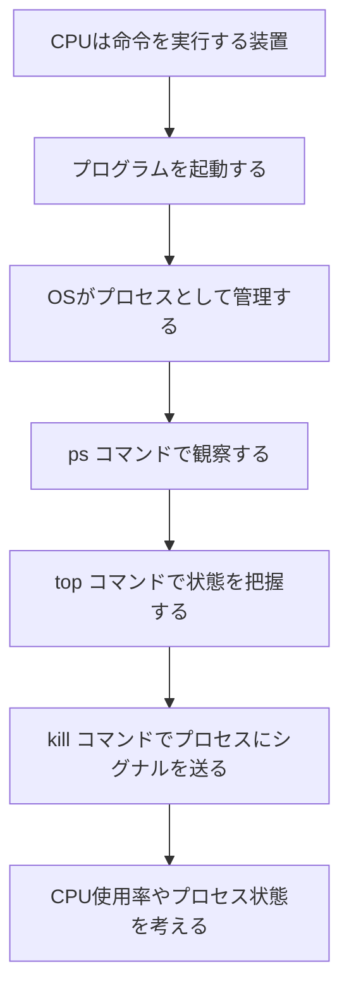
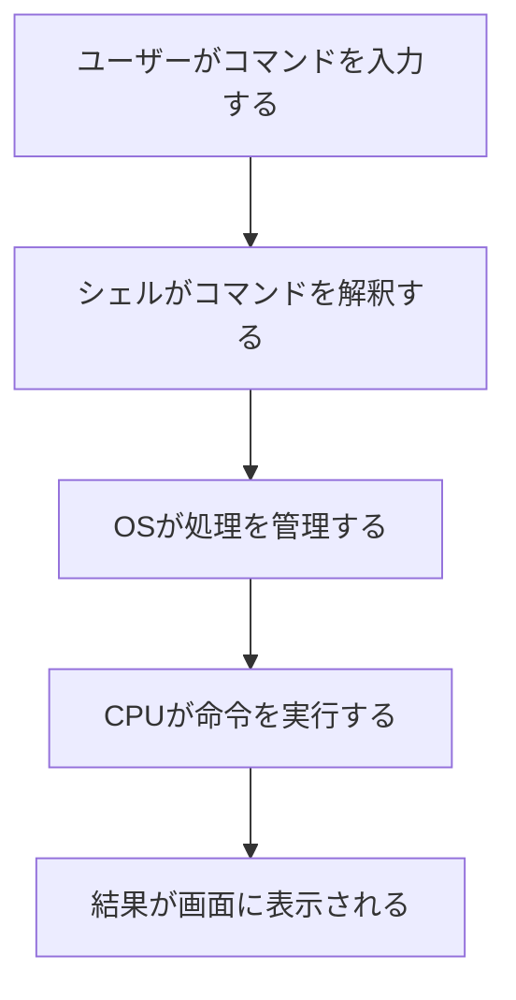
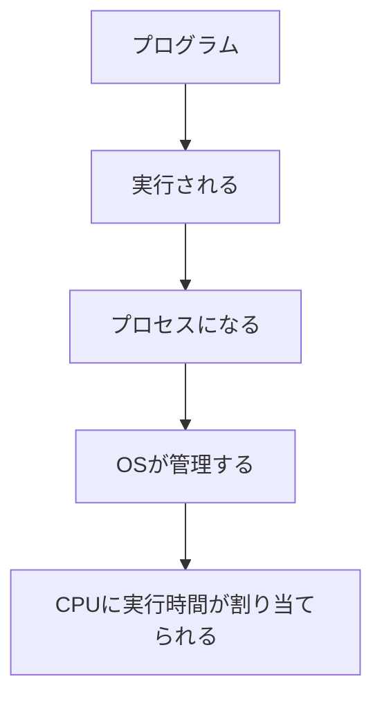
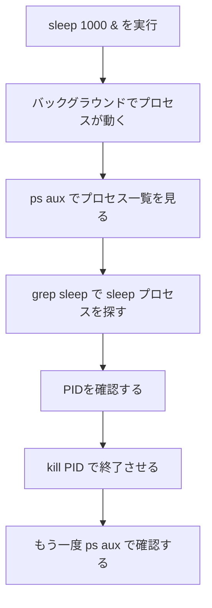

# 02 CPU and Process

## この章の目的

この章では、CPUとプロセスの関係を学びます。

コンピュータでは、プログラムを実行すると、OSがそれを「プロセス」として管理します。
CPUは、そのプロセスに対して処理時間を割り当て、命令を実行します。

普段は見えにくいCPUとプロセスの関係を、Linuxコマンドを使って観察します。

---

## この章で学ぶ流れ



---

## キーワード

* CPU
* プログラム
* プロセス
* PID
* バックグラウンド実行
* CPU使用率
* シグナル
* `ps`
* `top`
* `kill`

---

## CPUとは何か

CPUは、コンピュータの中で命令を実行する装置です。

プログラムに書かれた命令は、最終的にはCPUによって処理されます。
ただし、私たちが普段Linuxを操作しているとき、CPUを直接操作しているわけではありません。

私たちはコマンドを入力し、OSがその処理を受け取り、必要に応じてCPUに処理を割り当てています。



---

## プログラムとプロセス

プログラムは、命令が書かれたファイルや処理のまとまりです。
しかし、プログラムは置いてあるだけでは動きません。

プログラムが実行されると、OSはそれを「プロセス」として管理します。



たとえば、次のコマンドを実行すると、`sleep` というプログラムが実行されます。

```bash
sleep 1000
```

このとき、Linux上では `sleep` のプロセスが作られます。

---

## プロセスを観察する

まず、長時間動くプロセスを作ってみます。

```bash
sleep 1000 &
```

最後に `&` をつけると、コマンドをバックグラウンドで実行できます。
バックグラウンドで実行すると、シェルの操作を続けることができます。

次に、動いているプロセスを確認します。

```bash
ps aux | grep sleep
```

`ps` コマンドは、現在動いているプロセスを表示するコマンドです。
`grep sleep` を使うことで、`sleep` を含む行だけを取り出しています。

---

## ps aux の見方

`ps aux` の結果には、次のような列が表示されます。

```text
USER         PID %CPU %MEM    VSZ   RSS TTY      STAT START   TIME COMMAND
```

それぞれの意味は次の通りです。

| 項目 | 意味 |
| --- | --- |
| `USER` | そのプロセスを実行しているユーザー |
| `PID` | プロセスID |
| `%CPU` | CPU使用率 |
| `%MEM` | メモリ使用率 |
| `VSZ` | 仮想メモリ使用量（KB） |
| `RSS` | 物理メモリ使用量（KB） |
| `TTY` | どの端末から実行されたか |
| `STAT` | プロセス状態（実行中・待機中など） |
| `START` | プロセス開始時刻 |
| `TIME` | CPU使用時間の累計 |
| `COMMAND` | 実行中のコマンド |

特に `STAT` は、プロセスの状態を把握するために重要です。

---

## STAT の主な記号

`STAT` には、状態を表す1文字と、補助情報を表す文字が組み合わさって表示されます。

よく見る主な状態文字は次の通りです。

| 記号 | 意味 |
| --- | --- |
| `R` | 実行中（Running） |
| `S` | 割り込み可能な待機（Sleep） |
| `D` | 割り込み不可の待機（主にI/O待ち） |
| `T` | 停止中（Stop/Trace中） |
| `Z` | ゾンビプロセス |
| `I` | アイドル中のカーネルスレッド |

補助記号として、次の文字が付くことがあります。

| 記号 | 意味 |
| --- | --- |
| `<` | 高優先度 |
| `N` | 低優先度 |
| `L` | メモリをロックしている |
| `s` | セッションリーダー |
| `l` | マルチスレッド |
| `+` | フォアグラウンドプロセスグループ |

たとえば `Ss` は「待機中（S）で、セッションリーダー（s）」を意味します。
`R+` は「実行中（R）で、フォアグラウンド（+）」を意味します。

---

## top で見る Nice 値（NI）

`top` のプロセス一覧には、`NI`（Nice値）という列があります。
`PR` は `Priority`（優先度）の略です。

Nice値は、CPUの取り合いが起きたときに「そのプロセスをどのくらい優先するか」を表す目安です。

| 項目 | 意味 |
| --- | --- |
| `NI` | Nice値（優先度の調整値） |
| `PR` | Priority（優先度）。カーネルが実際に使うスケジューリング優先度 |

基本的な見方は次の通りです。

| NIの傾向 | 解釈 |
| --- | --- |
| 小さい（負の方向） | 優先されやすい |
| 0 | 標準 |
| 大きい（正の方向） | 優先されにくい |

整理すると、`NI` はユーザーが優先度を調整するための値で、`PR` はOSが最終的に扱う優先度です。

通常ユーザーが `nice` コマンドで起動する場合は、正の値を使って他プロセスへの影響を下げることが多いです。

```bash
nice -n 10 sleep 1000
```

すでに動いているプロセスのNice値を変更する場合は、`renice` を使います。

```bash
renice 10 -p <PID>
```

`top` では、`NI` と `%CPU` をあわせて見ることで、
「CPUを使っている理由が処理内容によるものか、優先度設定によるものか」を考えやすくなります。

---

## プロセスを観察する流れ



---

## PIDとは何か

PIDは、Process ID の略です。
Linuxでは、実行中のプロセスに番号が割り当てられます。

この番号を使うことで、OSはどのプロセスを操作するのかを区別しています。

たとえば、次のような表示があったとします。

```text
student   12345  0.0  0.0   9876  1234 pts/0    S    10:00   0:00 sleep 1000
```

この場合、`12345` がPIDです。

プロセスを終了したい場合は、このPIDを使います。

```bash
kill 12345
```

---

## kill コマンド

`kill` コマンドは、プロセスにシグナルを送るコマンドです。

名前だけ見ると「強制終了するコマンド」のように見えますが、正確には「プロセスにシグナルを送るコマンド」です。

通常は、プロセスに終了を依頼するために使います。

```bash
kill <PID>
```

例：

```bash
kill 12345
```

プロセスが終了したかどうか、もう一度確認します。

```bash
ps aux | grep sleep
```

---

## top コマンドで状態を把握する

`top` コマンドを使うと、CPU使用率やメモリ使用量、実行中のプロセスをリアルタイムで確認できます。

```bash
top
```

`top` を終了するときは、`q` キーを押します。

`top` では、次のような情報を観察できます。

* どのプロセスが動いているか
* CPUを多く使っているプロセスはどれか
* メモリを多く使っているプロセスはどれか
* プロセスのPIDは何か

---

## CPU使用率を見る

CPU使用率は、CPUがどのくらい処理に使われているかを表します。

CPU使用率が高いプロセスは、多くの計算処理を行っている可能性があります。

ただし、CPU使用率が高いこと自体が悪いわけではありません。
必要な処理をしている場合もあります。

大切なのは、次のように観察することです。

* どのプロセスがCPUを使っているのか
* そのプロセスは必要なものなのか
* 予想外にCPUを使っていないか
* 止めてもよいプロセスなのか

---

## 実習1：sleep プロセスを作って確認する

次のコマンドを実行します。

```bash
sleep 1000 &
```

プロセスを確認します。

```bash
ps aux | grep sleep
```

確認するポイント：

* `sleep 1000` の行があるか
* PIDは何番か
* 自分のユーザー名で実行されているか

---

## 実習2：PIDを指定してプロセスを終了する

`ps aux | grep sleep` で確認したPIDを使って、プロセスを終了します。

```bash
kill <PID>
```

例：

```bash
kill 12345
```

もう一度確認します。

```bash
ps aux | grep sleep
```

`sleep 1000` のプロセスが表示されなければ、終了できています。

---

## 実習3：top でプロセスを観察する

次のコマンドを実行します。

```bash
top
```

確認するポイント：

* CPU使用率
* メモリ使用率
* 実行中のプロセス
* PID
* コマンド名

終了するときは、`q` キーを押します。

---

## 考えてみよう

次の問いについて考えてみましょう。

1. プログラムとプロセスの違いは何ですか？
2. PIDは何のためにありますか？
3. `kill` コマンドは、正確には何をしているコマンドですか？
4. CPU使用率が高いプロセスは、必ず悪いプロセスと言えますか？
5. `sleep 1000 &` の `&` は何を意味していますか？

---

## まとめ

この章では、CPUとプロセスの関係を学びました。

プログラムは、実行されることでプロセスになります。
OSはプロセスを管理し、CPUに処理時間を割り当てます。

Linuxでは、`ps` や `top` を使うことで、動いているプロセスを観察できます。
また、`kill` コマンドを使うことで、プロセスにシグナルを送ることができます。

CPUやプロセスは、教科書だけでは見えにくい内容です。
しかし、Linuxコマンドを使うことで、実際に観察することができます。

---

## この章のポイント

* CPUは命令を実行する装置である
* プログラムは実行されるとプロセスになる
* OSはプロセスを管理している
* プロセスにはPIDが割り当てられる
* `ps` コマンドでプロセスを確認できる
* `top` コマンドでCPU使用率やプロセス状態を観察できる
* `kill` コマンドはプロセスにシグナルを送るコマンドである

---

## 次に学ぶこと

次の章では、メモリやストレージなど、コンピュータの資源がどのように使われているかを学びます。

プロセスはCPUだけでなく、メモリやファイルとも関係しています。
コンピュータの中で何が起きているのかを、引き続きLinuxコマンドで観察していきます。
