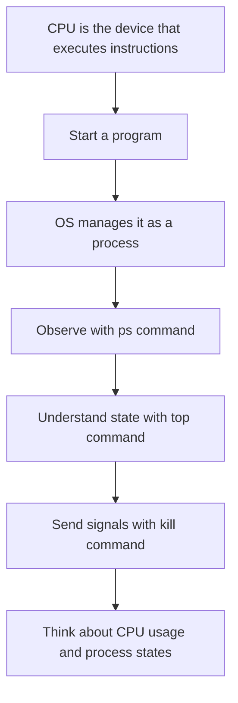
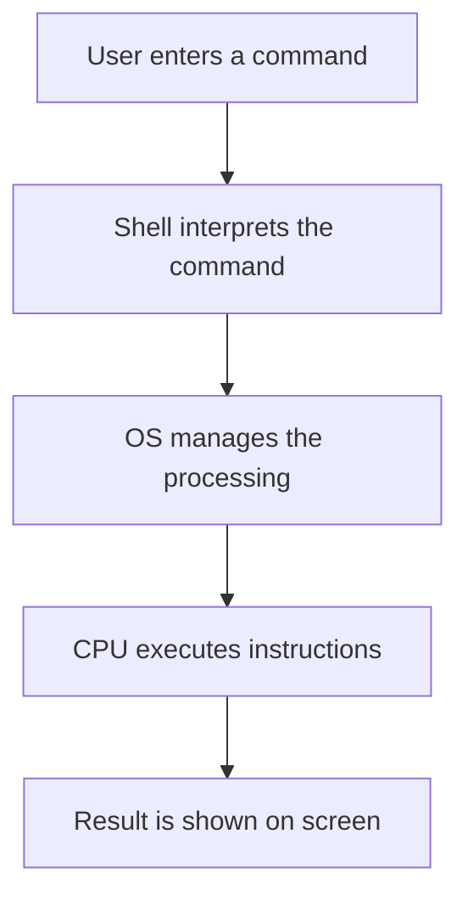
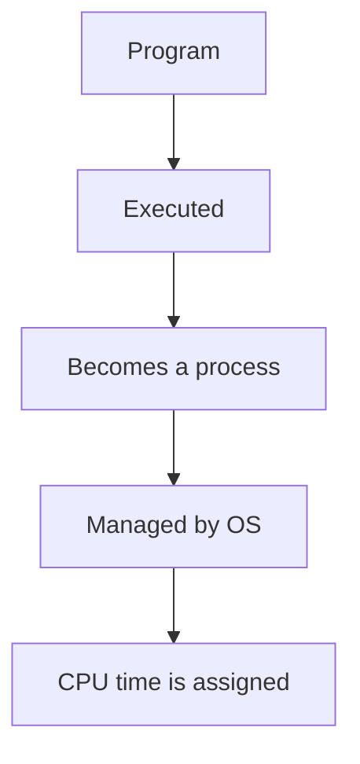
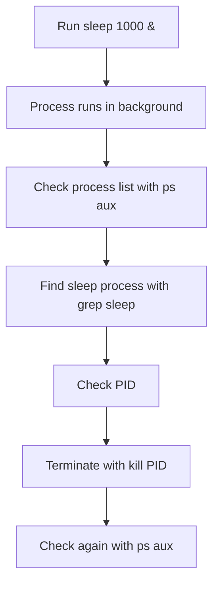

# 02 CPU and Process

## Goal of this chapter

In this chapter, you will learn the relationship between CPU and processes.

On a computer, when a program is executed, the OS manages it as a "process."
The CPU assigns processing time to that process and executes instructions.

You will observe the relationship between CPU and processes, which is usually hard to see directly, using Linux commands.

---

## Chapter flow



---

## Keywords

- CPU
- Program
- Process
- PID
- Background execution
- CPU usage
- Signal
- `ps`
- `top`
- `kill`

---

## What is CPU?

CPU is the device in a computer that executes instructions.

Instructions written in programs are ultimately processed by the CPU.
However, when we usually operate Linux, we are not controlling the CPU directly.

We enter commands, the OS receives the request, and then assigns CPU time as needed.



---

## Program and process

A program is a file or unit containing instructions.
But a program does not run by itself just by existing.

When a program is executed, the OS manages it as a "process."



For example, when you run the command below, the `sleep` program runs.

```bash
sleep 1000
```

At this time, a `sleep` process is created on Linux.

---

## Observe processes

First, create a long-running process.

```bash
sleep 1000 &
```

If you add `&` at the end, the command runs in the background.
When it runs in the background, you can continue using the shell.

Next, check the running process.

```bash
ps aux | grep sleep
```

The `ps` command displays currently running processes.
Using `grep sleep` extracts only lines that include `sleep`.

---

## How to read `ps aux`

The output of `ps aux` has columns like this:

```text
USER         PID %CPU %MEM    VSZ   RSS TTY      STAT START   TIME COMMAND
```

The meaning of each column:

| Field | Meaning |
| --- | --- |
| `USER` | User running the process |
| `PID` | Process ID |
| `%CPU` | CPU usage |
| `%MEM` | Memory usage |
| `VSZ` | Virtual memory size (KB) |
| `RSS` | Resident memory size (KB) |
| `TTY` | Terminal used to start the process |
| `STAT` | Process state (running, sleeping, etc.) |
| `START` | Start time of the process |
| `TIME` | Accumulated CPU time |
| `COMMAND` | Running command |

`STAT` is especially important for understanding process states.

---

## Main `STAT` symbols

`STAT` is shown as a combination of one state letter and optional helper letters.

Common state letters:

| Symbol | Meaning |
| --- | --- |
| `R` | Running |
| `S` | Interruptible sleep |
| `D` | Uninterruptible sleep (often I/O wait) |
| `T` | Stopped (or being traced) |
| `Z` | Zombie process |
| `I` | Idle kernel thread |

You may also see helper letters:

| Symbol | Meaning |
| --- | --- |
| `<` | High priority |
| `N` | Low priority |
| `L` | Has locked pages in memory |
| `s` | Session leader |
| `l` | Multithreaded |
| `+` | Foreground process group |

For example, `Ss` means "sleeping (`S`) and session leader (`s`)".
`R+` means "running (`R`) and foreground (`+`)".

---

## Nice value (`NI`) in `top`

In the process list of `top`, there is a column called `NI` (Nice value).
`PR` is short for `Priority`.

The Nice value is a guideline for how much a process should be favored when CPU contention occurs.

| Field | Meaning |
| --- | --- |
| `NI` | Nice value (priority adjustment value) |
| `PR` | Priority used by the kernel scheduler |

Basic interpretation:

| NI tendency | Interpretation |
| --- | --- |
| Smaller (negative) | More favored |
| 0 | Standard |
| Larger (positive) | Less favored |

In short, `NI` is the value users adjust, while `PR` is the final priority used by the OS.

When starting a command with lower impact on other processes, users often choose a positive value:

```bash
nice -n 10 sleep 1000
```

To change Nice value for an already running process, use `renice`:

```bash
renice 10 -p <PID>
```

In `top`, viewing `NI` together with `%CPU` helps you reason whether CPU usage is due to workload or due to priority settings.

---

## Flow for observing processes



---

## What is PID?

PID stands for Process ID.
In Linux, each running process is assigned a number.

Using this number, the OS can distinguish which process to control.

For example:

```text
student   12345  0.0  0.0   9876  1234 pts/0    S    10:00   0:00 sleep 1000
```

In this case, `12345` is the PID.

To stop a process, use this PID.

```bash
kill 12345
```

---

## `kill` command

The `kill` command sends a signal to a process.

From the name, it may look like a force-stop command, but more precisely it is a signal-sending command.

Normally, it is used to request process termination.

```bash
kill <PID>
```

Example:

```bash
kill 12345
```

Check again whether the process ended:

```bash
ps aux | grep sleep
```

---

## Understand state with `top`

With `top`, you can see CPU usage, memory usage, and running processes in real time.

```bash
top
```

Press `q` to exit `top`.

In `top`, observe:

- Which processes are running
- Which process uses much CPU
- Which process uses much memory
- PID of each process

---

## Check CPU usage

CPU usage shows how much CPU time is being used.

A process with high CPU usage may be performing heavy calculations.

However, high CPU usage is not always bad.
It may be necessary work.

What matters is to observe:

- Which process is using CPU
- Whether that process is necessary
- Whether it is using CPU unexpectedly
- Whether it can be safely stopped

---

## Practice 1: Create and verify a `sleep` process

Run:

```bash
sleep 1000 &
```

Check the process:

```bash
ps aux | grep sleep
```

Check points:

- Is there a line for `sleep 1000`?
- What is the PID?
- Is it running under your user account?

---

## Practice 2: Terminate a process by PID

Use the PID found by `ps aux | grep sleep` to terminate the process.

```bash
kill <PID>
```

Example:

```bash
kill 12345
```

Check again:

```bash
ps aux | grep sleep
```

If `sleep 1000` is no longer shown, the process has ended.

---

## Practice 3: Observe processes with `top`

Run:

```bash
top
```

Check points:

- CPU usage
- Memory usage
- Running processes
- PID
- Command name

Press `q` to exit.

---

## Think about it

Consider the following questions.

1. What is the difference between a program and a process?
2. Why do we need PID?
3. What does `kill` do, precisely?
4. Is a high-CPU process always bad?
5. What does `&` mean in `sleep 1000 &`?

---

## Summary

In this chapter, you learned the relationship between CPU and processes.

A program becomes a process when executed.
The OS manages processes and assigns CPU time.

In Linux, `ps` and `top` let you observe running processes.
And `kill` lets you send signals to processes.

CPU and process behavior is hard to see from textbooks alone.
Using Linux commands, you can observe it directly.

---

## Key points of this chapter

- CPU is the device that executes instructions
- A program becomes a process when executed
- OS manages processes
- Each process has a PID
- You can check processes with `ps`
- You can observe CPU usage and process state with `top`
- `kill` sends signals to processes

---

## What you will learn next

In the next chapter, you will learn how computer resources such as memory and storage are used.

Processes are related not only to CPU but also to memory and files.
You will continue observing what happens inside a computer with Linux commands.