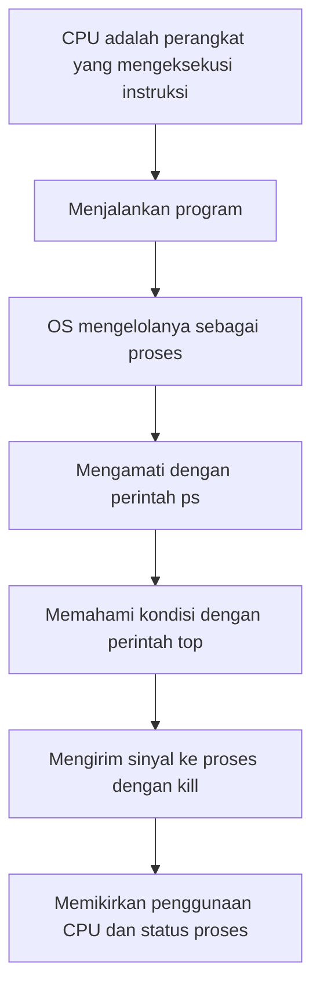
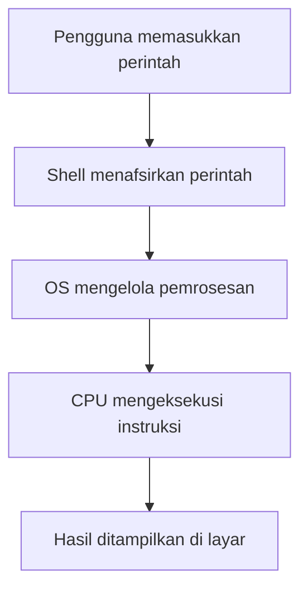
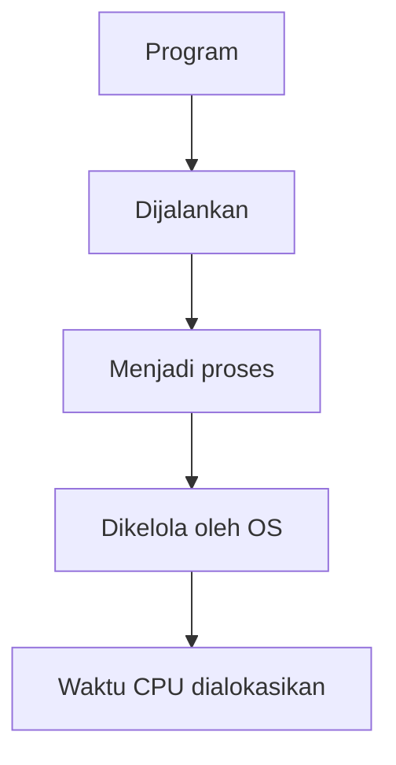
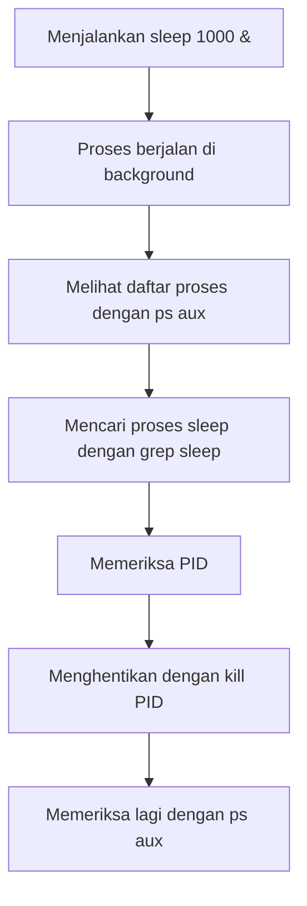

# 02 CPU and Process

## Tujuan bab ini

Pada bab ini, Anda akan mempelajari hubungan antara CPU dan proses.

Di komputer, ketika program dijalankan, OS mengelolanya sebagai "proses".
CPU memberikan jatah waktu pemrosesan kepada proses tersebut dan mengeksekusi instruksi.

Hubungan CPU dan proses biasanya sulit terlihat langsung.
Di bab ini, Anda akan mengamatinya menggunakan perintah Linux.

---

## Alur bab ini



---

## Kata kunci

- CPU
- Program
- Proses
- PID
- Eksekusi di latar belakang
- Penggunaan CPU
- Sinyal
- `ps`
- `top`
- `kill`

---

## Apa itu CPU

CPU adalah perangkat di dalam komputer yang mengeksekusi instruksi.

Instruksi yang ditulis dalam program pada akhirnya diproses oleh CPU.
Namun, saat kita menggunakan Linux sehari-hari, kita tidak mengendalikan CPU secara langsung.

Kita memasukkan perintah, OS menerima pemrosesan tersebut, lalu mengalokasikan CPU sesuai kebutuhan.



---

## Program dan proses

Program adalah berkas berisi instruksi atau satu kesatuan pemrosesan.
Namun, program tidak berjalan hanya karena ada.

Ketika program dijalankan, OS mengelolanya sebagai "proses".



Sebagai contoh, saat menjalankan perintah berikut, program `sleep` dijalankan.

```bash
sleep 1000
```

Pada saat itu, proses `sleep` dibuat di Linux.

---

## Mengamati proses

Pertama, buat proses yang berjalan lama.

```bash
sleep 1000 &
```

Jika menambahkan `&` di akhir, perintah dijalankan di background.
Saat berjalan di background, Anda tetap bisa melanjutkan penggunaan shell.

Berikutnya, periksa proses yang sedang berjalan.

```bash
ps aux | grep sleep
```

Perintah `ps` menampilkan proses yang sedang berjalan.
Dengan `grep sleep`, hanya baris yang mengandung `sleep` yang diambil.

---

## Cara membaca `ps aux`

Hasil `ps aux` memiliki kolom seperti ini:

```text
USER         PID %CPU %MEM    VSZ   RSS TTY      STAT START   TIME COMMAND
```

Arti tiap kolom:

| Kolom | Arti |
| --- | --- |
| `USER` | Pengguna yang menjalankan proses |
| `PID` | Process ID |
| `%CPU` | Persentase penggunaan CPU |
| `%MEM` | Persentase penggunaan memori |
| `VSZ` | Ukuran memori virtual (KB) |
| `RSS` | Ukuran memori fisik yang dipakai (KB) |
| `TTY` | Terminal tempat proses dijalankan |
| `STAT` | Status proses (berjalan, menunggu, dll.) |
| `START` | Waktu proses mulai |
| `TIME` | Akumulasi waktu CPU |
| `COMMAND` | Perintah yang dijalankan |

`STAT` sangat penting untuk memahami keadaan proses.

---

## Simbol utama pada `STAT`

`STAT` ditampilkan sebagai kombinasi huruf status utama dan huruf tambahan.

Simbol status utama yang sering muncul:

| Simbol | Arti |
| --- | --- |
| `R` | Running (sedang berjalan) |
| `S` | Sleep yang dapat diinterupsi |
| `D` | Sleep yang tidak dapat diinterupsi (sering I/O wait) |
| `T` | Stopped / sedang ditelusuri |
| `Z` | Zombie process |
| `I` | Idle kernel thread |

Simbol tambahan yang mungkin muncul:

| Simbol | Arti |
| --- | --- |
| `<` | Prioritas tinggi |
| `N` | Prioritas rendah |
| `L` | Memori dikunci |
| `s` | Session leader |
| `l` | Multithread |
| `+` | Foreground process group |

Contoh `Ss` berarti "sleep (`S`) dan session leader (`s`)".
`R+` berarti "running (`R`) dan foreground (`+`)".

---

## Nilai Nice (`NI`) pada `top`

Di daftar proses `top`, ada kolom `NI` (Nice value).
`PR` adalah singkatan dari `Priority`.

Nice value adalah acuan seberapa diprioritaskan sebuah proses saat terjadi perebutan CPU.

| Kolom | Arti |
| --- | --- |
| `NI` | Nice value (nilai penyesuaian prioritas) |
| `PR` | Priority yang dipakai scheduler kernel |

Cara baca dasarnya:

| Kecenderungan NI | Interpretasi |
| --- | --- |
| Lebih kecil (arah negatif) | Lebih diprioritaskan |
| 0 | Standar |
| Lebih besar (arah positif) | Kurang diprioritaskan |

Ringkasnya, `NI` adalah nilai yang diatur pengguna, sedangkan `PR` adalah prioritas akhir yang dipakai OS.

Saat memulai proses agar dampaknya ke proses lain lebih kecil, biasanya dipakai nilai positif:

```bash
nice -n 10 sleep 1000
```

Untuk mengubah Nice value proses yang sudah berjalan, gunakan `renice`:

```bash
renice 10 -p <PID>
```

Di `top`, melihat `NI` bersama `%CPU` membantu menilai apakah penggunaan CPU karena beban kerja atau karena pengaturan prioritas.

---

## Alur mengamati proses



---

## Apa itu PID

PID adalah singkatan dari Process ID.
Di Linux, setiap proses yang berjalan diberi nomor.

Dengan nomor ini, OS dapat membedakan proses mana yang akan dikendalikan.

Contoh tampilan:

```text
student   12345  0.0  0.0   9876  1234 pts/0    S    10:00   0:00 sleep 1000
```

Dalam contoh ini, `12345` adalah PID.

Jika ingin menghentikan proses, gunakan PID tersebut.

```bash
kill 12345
```

---

## Perintah `kill`

Perintah `kill` digunakan untuk mengirim sinyal ke proses.

Dari namanya terlihat seperti perintah paksa berhenti, tetapi secara tepat ini adalah perintah pengiriman sinyal.

Biasanya dipakai untuk meminta proses berhenti.

```bash
kill <PID>
```

Contoh:

```bash
kill 12345
```

Periksa lagi apakah proses sudah berhenti:

```bash
ps aux | grep sleep
```

---

## Memahami keadaan dengan `top`

Dengan `top`, Anda bisa melihat penggunaan CPU, penggunaan memori, dan proses berjalan secara real-time.

```bash
top
```

Untuk keluar dari `top`, tekan `q`.

Hal yang diamati di `top`:

- Proses apa saja yang berjalan
- Proses mana yang banyak memakai CPU
- Proses mana yang banyak memakai memori
- PID tiap proses

---

## Melihat penggunaan CPU

Penggunaan CPU menunjukkan seberapa banyak CPU dipakai untuk pemrosesan.

Proses dengan penggunaan CPU tinggi mungkin sedang melakukan perhitungan berat.

Namun, penggunaan CPU tinggi tidak selalu berarti buruk.
Bisa jadi proses itu memang diperlukan.

Yang penting adalah mengamati:

- Proses mana yang menggunakan CPU
- Apakah proses itu diperlukan
- Apakah penggunaan CPU tinggi terjadi di luar dugaan
- Apakah proses tersebut aman untuk dihentikan

---

## Praktik 1: Buat dan cek proses `sleep`

Jalankan:

```bash
sleep 1000 &
```

Periksa proses:

```bash
ps aux | grep sleep
```

Poin pengecekan:

- Apakah ada baris `sleep 1000`
- Berapa PID-nya
- Apakah dijalankan oleh user Anda

---

## Praktik 2: Hentikan proses dengan PID

Gunakan PID yang ditemukan dari `ps aux | grep sleep` untuk menghentikan proses.

```bash
kill <PID>
```

Contoh:

```bash
kill 12345
```

Periksa lagi:

```bash
ps aux | grep sleep
```

Jika `sleep 1000` tidak lagi muncul, proses berhasil dihentikan.

---

## Praktik 3: Amati proses dengan `top`

Jalankan:

```bash
top
```

Poin pengecekan:

- Penggunaan CPU
- Penggunaan memori
- Proses yang sedang berjalan
- PID
- Nama perintah

Untuk keluar, tekan `q`.

---

## Mari berpikir

Pikirkan pertanyaan berikut.

1. Apa perbedaan program dan proses?
2. Mengapa PID diperlukan?
3. Secara tepat, apa yang dilakukan perintah `kill`?
4. Apakah proses dengan CPU tinggi selalu buruk?
5. Apa arti `&` pada `sleep 1000 &`?

---

## Ringkasan

Pada bab ini, Anda mempelajari hubungan antara CPU dan proses.

Program yang dijalankan menjadi proses.
OS mengelola proses dan mengalokasikan waktu CPU.

Di Linux, Anda dapat mengamati proses berjalan dengan `ps` dan `top`.
Selain itu, dengan `kill`, Anda bisa mengirim sinyal ke proses.

CPU dan proses sulit dipahami jika hanya dari buku.
Dengan perintah Linux, Anda bisa mengamatinya secara langsung.

---

## Poin penting bab ini

- CPU adalah perangkat yang mengeksekusi instruksi
- Program yang dijalankan menjadi proses
- OS mengelola proses
- Setiap proses memiliki PID
- Proses dapat diperiksa dengan `ps`
- Penggunaan CPU dan status proses dapat diamati dengan `top`
- `kill` adalah perintah untuk mengirim sinyal ke proses

---

## Apa yang dipelajari berikutnya

Pada bab berikutnya, Anda akan mempelajari bagaimana sumber daya komputer seperti memori dan penyimpanan digunakan.

Proses terkait bukan hanya CPU, tetapi juga memori dan berkas.
Anda akan melanjutkan observasi tentang apa yang terjadi di dalam komputer dengan perintah Linux.