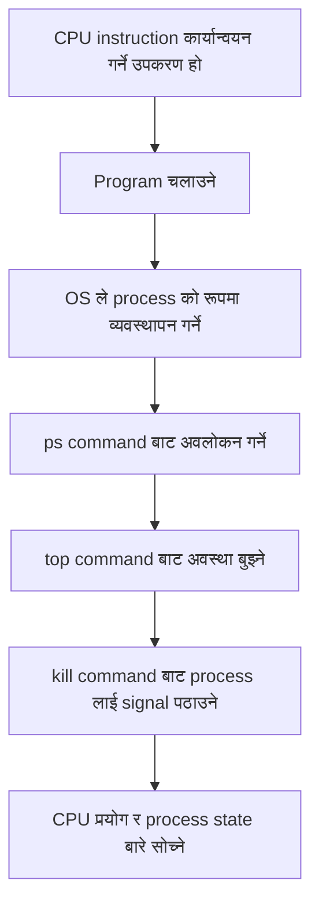
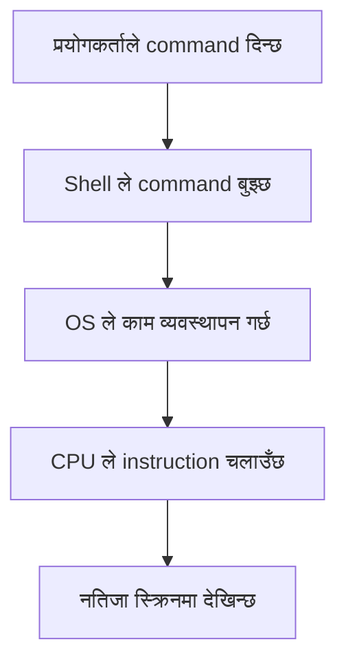
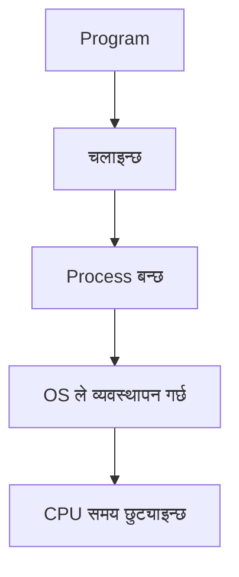
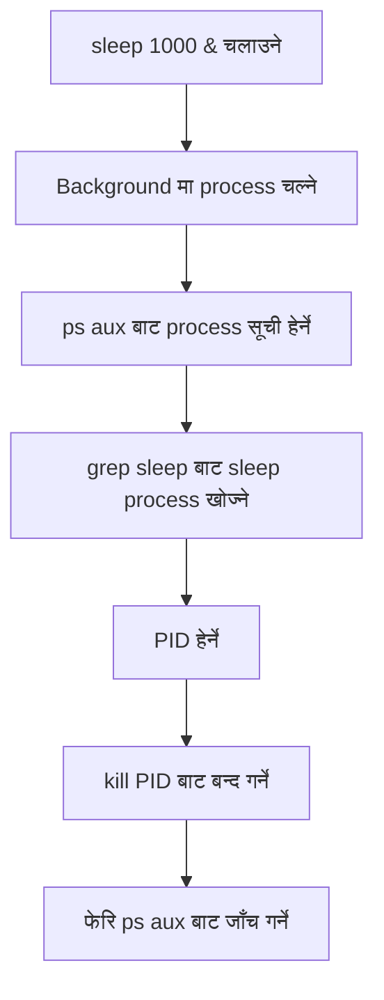

# 02 CPU and Process

## यस अध्यायको उद्देश्य

यस अध्यायमा तपाईं CPU र process बीचको सम्बन्ध सिक्नुहुनेछ।

कम्प्युटरमा program चलाउँदा OS ले त्यसलाई "process" को रूपमा व्यवस्थापन गर्छ।
CPU ले त्यस process लाई processing time दिन्छ र instruction कार्यान्वयन गर्छ।

सिधै देख्न गाह्रो हुने CPU र process को सम्बन्धलाई Linux command प्रयोग गरेर अवलोकन गरिन्छ।

---

## यस अध्यायको प्रवाह



---

## मुख्य शब्दहरू

- CPU
- Program
- Process
- PID
- Background execution
- CPU usage
- Signal
- `ps`
- `top`
- `kill`

---

## CPU भनेको के हो

CPU भनेको कम्प्युटरभित्र instruction कार्यान्वयन गर्ने उपकरण हो।

Program मा लेखिएका instruction अन्ततः CPU ले नै process गर्छ।
तर हामीले Linux चलाउँदा CPU लाई सिधै नियन्त्रण गरिरहेका हुँदैनौं।

हामी command दिन्छौं, OS ले काम व्यवस्थापन गर्छ, र आवश्यक अनुसार CPU समय छुट्याउँछ।



---

## Program र process

Program भनेको instruction भएको file वा कामको समूह हो।
तर program केवल file भएर बसेको अवस्थामा चल्दैन।

Program चलाउँदा OS ले त्यसलाई "process" को रूपमा व्यवस्थापन गर्छ।



उदाहरणका लागि, तलको command चलाउँदा `sleep` program चल्छ।

```bash
sleep 1000
```

यस बेला Linux मा `sleep` process बन्छ।

---

## Process अवलोकन गर्ने

पहिला, लामो समय चल्ने process बनाउनुहोस्।

```bash
sleep 1000 &
```

अन्त्यमा `&` राख्दा command background मा चल्छ।
Background मा चलेपछि shell मा अरू काम जारी राख्न सकिन्छ।

अब चलिरहेको process हेर्नुहोस्।

```bash
ps aux | grep sleep
```

`ps` ले चलिरहेको process देखाउँछ।
`grep sleep` ले `sleep` भएको लाइन मात्र निकाल्छ।

---

## `ps aux` कसरी पढ्ने

`ps aux` को output मा यस्ता column देखिन्छन्:

```text
USER         PID %CPU %MEM    VSZ   RSS TTY      STAT START   TIME COMMAND
```

प्रत्येक column को अर्थ:

| क्षेत्र | अर्थ |
| --- | --- |
| `USER` | Process चलाउने प्रयोगकर्ता |
| `PID` | Process ID |
| `%CPU` | CPU प्रयोग प्रतिशत |
| `%MEM` | Memory प्रयोग प्रतिशत |
| `VSZ` | Virtual memory size (KB) |
| `RSS` | Physical memory usage (KB) |
| `TTY` | कुन terminal बाट चलाइएको हो |
| `STAT` | Process state |
| `START` | सुरु भएको समय |
| `TIME` | जम्मा CPU time |
| `COMMAND` | चलिरहेको command |

`STAT` process को अवस्था बुझ्न विशेष महत्त्वपूर्ण हुन्छ।

---

## `STAT` का मुख्य संकेतहरू

`STAT` मा मुख्य अवस्था देखाउने 1 अक्षर र थप जानकारी दिने अक्षरहरूको संयोजन हुन्छ।

धेरै देखिने मुख्य अवस्था अक्षरहरू:

| संकेत | अर्थ |
| --- | --- |
| `R` | Running |
| `S` | Interruptible sleep |
| `D` | Uninterruptible sleep (सामान्यतया I/O wait) |
| `T` | Stopped / traced |
| `Z` | Zombie process |
| `I` | Idle kernel thread |

थप संकेतहरू:

| संकेत | अर्थ |
| --- | --- |
| `<` | High priority |
| `N` | Low priority |
| `L` | Memory lock गरिएको |
| `s` | Session leader |
| `l` | Multithread |
| `+` | Foreground process group |

उदाहरण: `Ss` को अर्थ sleep (`S`) र session leader (`s`)।
`R+` को अर्थ running (`R`) र foreground (`+`)।

---

## `top` मा Nice value (`NI`)

`top` को process सूचीमा `NI` (Nice value) भन्ने column हुन्छ।
`PR` को पूरा रूप `Priority` हो।

CPU प्रतिस्पर्धा हुँदा process लाई कति प्राथमिकता दिने भन्ने संकेतका रूपमा Nice value प्रयोग हुन्छ।

| क्षेत्र | अर्थ |
| --- | --- |
| `NI` | Nice value (priority adjustment value) |
| `PR` | Kernel scheduler ले प्रयोग गर्ने priority |

सामान्य व्याख्या:

| NI को प्रवृत्ति | अर्थ |
| --- | --- |
| सानो (negative) | बढी प्राथमिकता |
| 0 | मानक |
| ठूलो (positive) | कम प्राथमिकता |

छोटोमा, `NI` प्रयोगकर्ताले मिलाउने मान हो, `PR` OS ले अन्तिम रूपमा प्रयोग गर्ने priority हो।

अरू process मा असर कम राख्न positive मान सहित command सुरु गर्ने अभ्यास हुन्छ:

```bash
nice -n 10 sleep 1000
```

चलिरहेको process को Nice value बदल्न `renice` प्रयोग हुन्छ:

```bash
renice 10 -p <PID>
```

`top` मा `NI` र `%CPU` सँगै हेर्दा CPU बढी प्रयोग workload का कारण हो कि priority सेटिङका कारण हो भन्ने बुझ्न सजिलो हुन्छ।

---

## Process अवलोकन गर्ने प्रवाह



---

## PID भनेको के हो

PID को पूरा रूप Process ID हो।
Linux मा चलिरहेका process लाई नम्बर दिइन्छ।

यो नम्बर प्रयोग गरेर OS ले कुन process लाई नियन्त्रण गर्ने छुट्याउँछ।

उदाहरण:

```text
student   12345  0.0  0.0   9876  1234 pts/0    S    10:00   0:00 sleep 1000
```

यो उदाहरणमा `12345` नै PID हो।

Process बन्द गर्न यही PID प्रयोग हुन्छ।

```bash
kill 12345
```

---

## `kill` command

`kill` command ले process लाई signal पठाउँछ।

नाम हेर्दा force stop जस्तो लागे पनि, सही अर्थमा यो signal पठाउने command हो।

सामान्यतया process बन्द गर्न अनुरोध गर्न प्रयोग गरिन्छ।

```bash
kill <PID>
```

उदाहरण:

```bash
kill 12345
```

Process बन्द भयो कि भएन फेरि जाँच गर्नुहोस्:

```bash
ps aux | grep sleep
```

---

## `top` बाट अवस्था बुझ्ने

`top` प्रयोग गर्दा CPU usage, memory usage, र चलिरहेको process real time मा देखिन्छ।

```bash
top
```

`top` बाट निस्कन `q` थिच्नुहोस्।

`top` मा हेर्नुपर्ने कुरा:

- कुन process चलिरहेका छन्
- CPU धेरै प्रयोग गर्ने process कुन हो
- Memory धेरै प्रयोग गर्ने process कुन हो
- PID

---

## CPU usage हेर्ने

CPU usage ले CPU कति काममा प्रयोग भएको छ देखाउँछ।

उच्च CPU usage भएका process ले भारी गणना गरिरहेको हुन सक्छ।

तर CPU usage धेरै हुनु सधैं खराब भन्ने हुँदैन।
आवश्यक काम पनि हुन सक्छ।

महत्त्वपूर्ण कुरा:

- CPU कसले प्रयोग गरिरहेको छ
- त्यो process आवश्यक छ कि छैन
- अपेक्षा बाहिर CPU प्रयोग त गरिरहेको छैन
- बन्द गर्न मिल्ने process हो कि होइन

---

## अभ्यास 1: `sleep` process बनाउने र जाँच गर्ने

चलाउनुहोस्:

```bash
sleep 1000 &
```

जाँच गर्नुहोस्:

```bash
ps aux | grep sleep
```

जाँच बुँदाहरू:

- `sleep 1000` लाइन छ कि छैन
- PID कति छ
- आफ्नो user बाट चलेको छ कि छैन

---

## अभ्यास 2: PID प्रयोग गरेर process बन्द गर्ने

`ps aux | grep sleep` बाट पाएको PID प्रयोग गरेर process बन्द गर्नुहोस्।

```bash
kill <PID>
```

उदाहरण:

```bash
kill 12345
```

फेरि जाँच गर्नुहोस्:

```bash
ps aux | grep sleep
```

`sleep 1000` नदेखिए process बन्द भइसकेको हो।

---

## अभ्यास 3: `top` बाट process अवलोकन गर्ने

चलाउनुहोस्:

```bash
top
```

जाँच बुँदाहरू:

- CPU usage
- Memory usage
- चलिरहेका process
- PID
- Command name

निस्कन `q` थिच्नुहोस्।

---

## सोचेर हेर्नुहोस्

तलका प्रश्नहरू विचार गर्नुहोस्:

1. Program र process बीचको फरक के हो?
2. PID किन आवश्यक छ?
3. `kill` command ले वास्तवमा के गर्छ?
4. CPU usage धेरै भएको process सधैं खराब हुन्छ?
5. `sleep 1000 &` मा `&` को अर्थ के हो?

---

## सारांश

यस अध्यायमा CPU र process बीचको सम्बन्ध सिकियो।

Program चल्दा process बन्छ।
OS ले process व्यवस्थापन गर्छ र CPU time छुट्याउँछ।

Linux मा `ps` र `top` बाट चलिरहेको process अवलोकन गर्न सकिन्छ।
`kill` ले process लाई signal पठाउन सकिन्छ।

CPU र process को व्यवहार किताबबाट मात्र बुझ्न गाह्रो हुन सक्छ।
Linux command प्रयोग गर्दा प्रत्यक्ष अवलोकन गर्न सकिन्छ।

---

## यस अध्यायका मुख्य बुँदाहरू

- CPU instruction चलाउने उपकरण हो
- Program चल्दा process बन्छ
- OS ले process व्यवस्थापन गर्छ
- प्रत्येक process सँग PID हुन्छ
- `ps` बाट process जाँच गर्न सकिन्छ
- `top` बाट CPU usage र process state हेर्न सकिन्छ
- `kill` process लाई signal पठाउने command हो

---

## अब के सिकिनेछ

अर्को अध्यायमा memory र storage जस्ता स्रोतहरू कसरी प्रयोग हुन्छन् भन्ने सिकिन्छ।

Process को सम्बन्ध CPU मात्र होइन, memory र file सँग पनि हुन्छ।
Linux command प्रयोग गरेर कम्प्युटरभित्र के भइरहेको छ भन्ने अवलोकन जारी राखिन्छ।