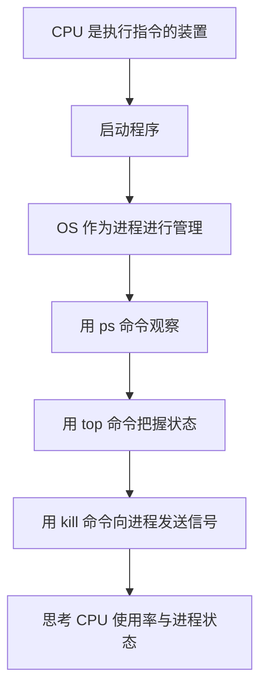
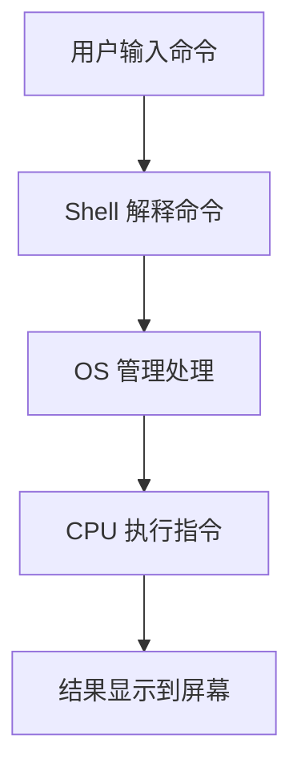
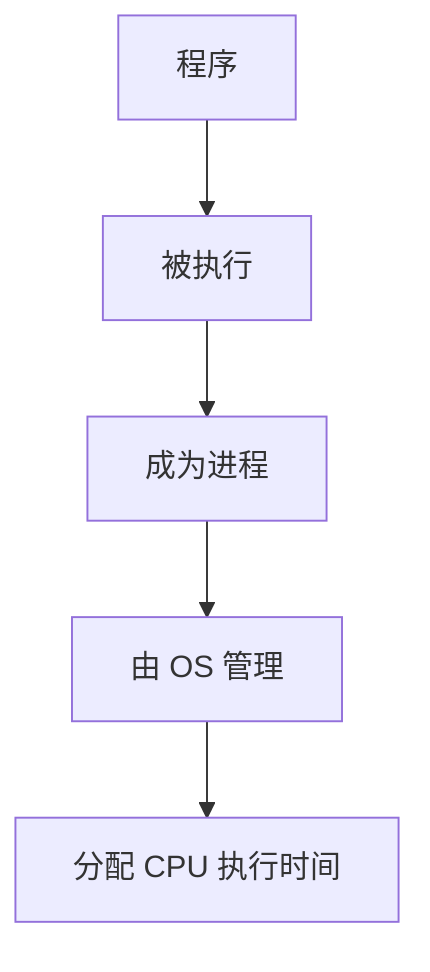
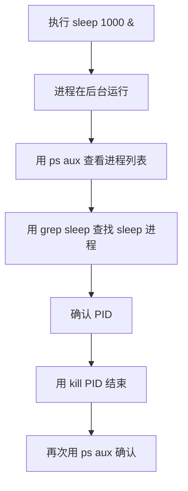

# 02 CPU and Process

## 本章目标

本章学习 CPU 与进程之间的关系。

在计算机中，当程序执行时，OS 会将其作为“进程”管理。
CPU 会为该进程分配处理时间并执行指令。

CPU 与进程的关系平时不容易直接看到。
本章将通过 Linux 命令进行观察。

---

## 本章流程



---

## 关键词

- CPU
- 程序
- 进程
- PID
- 后台执行
- CPU 使用率
- 信号
- `ps`
- `top`
- `kill`

---

## 什么是 CPU

CPU 是计算机中执行指令的装置。

程序中的指令最终由 CPU 处理。
但我们日常操作 Linux 时，并不是在直接操作 CPU。

我们输入命令，OS 接收并管理处理，再按需要分配 CPU 时间。



---

## 程序与进程

程序是包含指令的文件或处理单元。
但程序放在那里并不会自己运行。

当程序被执行时，OS 会将其作为“进程”管理。



例如，执行下面命令时，会运行 `sleep` 程序。

```bash
sleep 1000
```

此时 Linux 上会创建一个 `sleep` 进程。

---

## 观察进程

首先，创建一个运行时间较长的进程。

```bash
sleep 1000 &
```

末尾加上 `&` 可以在后台执行命令。
后台运行后，Shell 仍可继续操作。

然后，查看正在运行的进程。

```bash
ps aux | grep sleep
```

`ps` 用于显示当前运行中的进程。
`grep sleep` 用于提取包含 `sleep` 的行。

---

## 如何阅读 `ps aux`

`ps aux` 的输出中会看到如下列：

```text
USER         PID %CPU %MEM    VSZ   RSS TTY      STAT START   TIME COMMAND
```

各列含义如下：

| 字段 | 含义 |
| --- | --- |
| `USER` | 运行该进程的用户 |
| `PID` | 进程 ID |
| `%CPU` | CPU 使用率 |
| `%MEM` | 内存使用率 |
| `VSZ` | 虚拟内存大小（KB） |
| `RSS` | 常驻物理内存大小（KB） |
| `TTY` | 从哪个终端启动 |
| `STAT` | 进程状态（运行、等待等） |
| `START` | 进程开始时间 |
| `TIME` | 累计 CPU 时间 |
| `COMMAND` | 正在执行的命令 |

其中 `STAT` 对理解进程状态尤其重要。

---

## `STAT` 的主要符号

`STAT` 一般由一个主要状态字符和若干辅助字符组成。

常见主要状态字符：

| 符号 | 含义 |
| --- | --- |
| `R` | 运行中（Running） |
| `S` | 可中断睡眠（Sleep） |
| `D` | 不可中断睡眠（常见于 I/O 等待） |
| `T` | 已停止（Stop/Trace） |
| `Z` | 僵尸进程 |
| `I` | 空闲内核线程 |

常见辅助字符：

| 符号 | 含义 |
| --- | --- |
| `<` | 高优先级 |
| `N` | 低优先级 |
| `L` | 已锁定内存页 |
| `s` | 会话首进程 |
| `l` | 多线程 |
| `+` | 前台进程组 |

例如，`Ss` 表示“睡眠（`S`）且是会话首进程（`s`）”。
`R+` 表示“运行中（`R`）且在前台（`+`）”。

---

## `top` 中的 Nice 值（`NI`）

`top` 的进程列表中有 `NI`（Nice 值）这一列。
`PR` 是 `Priority`（优先级）的缩写。

当 CPU 竞争发生时，Nice 值用于表示进程应被优先对待的程度。

| 字段 | 含义 |
| --- | --- |
| `NI` | Nice 值（优先级调整值） |
| `PR` | 内核调度器实际使用的优先级 |

基本理解方式：

| NI 趋势 | 解读 |
| --- | --- |
| 更小（负方向） | 更容易被优先调度 |
| 0 | 标准 |
| 更大（正方向） | 更不容易被优先调度 |

简而言之，`NI` 是用户可调值，`PR` 是 OS 最终采用的优先级。

若希望降低对其他进程的影响，通常可用正值启动：

```bash
nice -n 10 sleep 1000
```

对已运行进程调整 Nice 值可使用 `renice`：

```bash
renice 10 -p <PID>
```

在 `top` 中结合观察 `NI` 与 `%CPU`，有助于判断 CPU 占用是由工作负载导致，还是由优先级设置导致。

---

## 观察进程的流程



---

## 什么是 PID

PID 是 Process ID 的缩写。
在 Linux 中，运行中的每个进程都会分配一个编号。

OS 通过这个编号区分要操作哪个进程。

例如：

```text
student   12345  0.0  0.0   9876  1234 pts/0    S    10:00   0:00 sleep 1000
```

这里的 `12345` 就是 PID。

如果要结束进程，就使用这个 PID。

```bash
kill 12345
```

---

## `kill` 命令

`kill` 用于向进程发送信号。

从名字看像“强制结束”，但准确地说，它是“发送信号”的命令。

通常用于请求进程退出。

```bash
kill <PID>
```

示例：

```bash
kill 12345
```

再检查一次是否结束：

```bash
ps aux | grep sleep
```

---

## 用 `top` 把握状态

通过 `top`，可以实时查看 CPU 使用率、内存使用量和正在运行的进程。

```bash
top
```

按 `q` 退出 `top`。

在 `top` 中可观察：

- 哪些进程在运行
- 哪些进程 CPU 占用高
- 哪些进程内存占用高
- 每个进程的 PID

---

## 查看 CPU 使用率

CPU 使用率表示 CPU 有多少时间用于处理。

CPU 使用率高的进程可能在执行较重计算。

但 CPU 使用率高本身并不一定是坏事。
也可能是必要处理。

关键是观察：

- 哪个进程在使用 CPU
- 该进程是否必要
- 是否出现了意外的高 CPU 占用
- 是否可以安全停止该进程

---

## 实践 1：创建并确认 `sleep` 进程

执行：

```bash
sleep 1000 &
```

确认进程：

```bash
ps aux | grep sleep
```

确认要点：

- 是否存在 `sleep 1000` 这一行
- PID 是多少
- 是否由你的用户运行

---

## 实践 2：按 PID 结束进程

使用 `ps aux | grep sleep` 查到的 PID 结束进程。

```bash
kill <PID>
```

示例：

```bash
kill 12345
```

再次确认：

```bash
ps aux | grep sleep
```

若不再显示 `sleep 1000`，说明已成功结束。

---

## 实践 3：用 `top` 观察进程

执行：

```bash
top
```

确认要点：

- CPU 使用率
- 内存使用率
- 正在运行的进程
- PID
- 命令名

按 `q` 退出。

---

## 思考一下

请思考以下问题：

1. 程序与进程有什么区别？
2. 为什么需要 PID？
3. `kill` 命令准确来说做了什么？
4. CPU 占用高的进程一定是坏进程吗？
5. `sleep 1000 &` 中的 `&` 表示什么？

---

## 总结

本章学习了 CPU 与进程的关系。

程序执行后会变成进程。
OS 管理进程并分配 CPU 时间。

在 Linux 中，可以通过 `ps` 和 `top` 观察运行中的进程。
也可以通过 `kill` 向进程发送信号。

CPU 和进程的行为仅靠教材不易直观理解。
使用 Linux 命令可以直接进行观察。

---

## 本章要点

- CPU 是执行指令的装置
- 程序执行后会成为进程
- OS 负责管理进程
- 每个进程都有 PID
- 可用 `ps` 查看进程
- 可用 `top` 观察 CPU 使用率与进程状态
- `kill` 是向进程发送信号的命令

---

## 下一步学习

下一章将学习内存、存储等计算机资源是如何被使用的。

进程不仅与 CPU 有关，也与内存和文件有关。
你将继续用 Linux 命令观察计算机内部发生的事情。